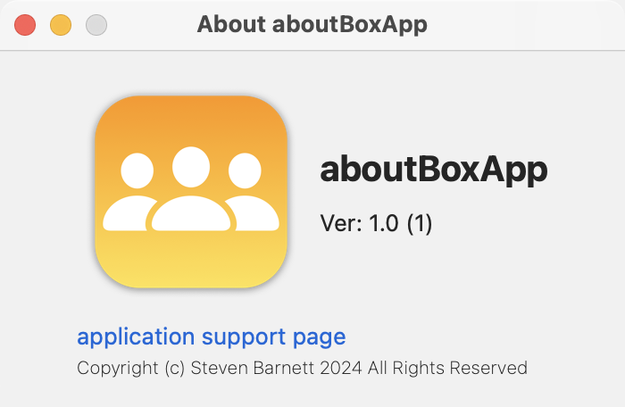

When I started trying to write a Mac app for the first time, I started out knowing what I wanted to achieve but not knowing how to go about it. I spent a lot of time googling for Mac development help and found very little of it. What I did find was mostly related to Objective-C and not Swift/SwiftUI.

So, I spent a lot of time going round in circles, extracting the bits that I thought relevant and heading down a lot of blind alleys.

This project is part of a seried of development notes I want to write to document some of the stuff I learnt along the way. The note that goes with it can be found on my web site.

 [About Box Article](http://www.sabarnett.co.uk/blogPage.php?id=aboutBox)

What I cover in this note is how to customise the supplied about box using RTF and HTML files and, when that isn't sufficient, how to replace the about box with one of our own where we have all the acilities of SwiftUI to call on.

